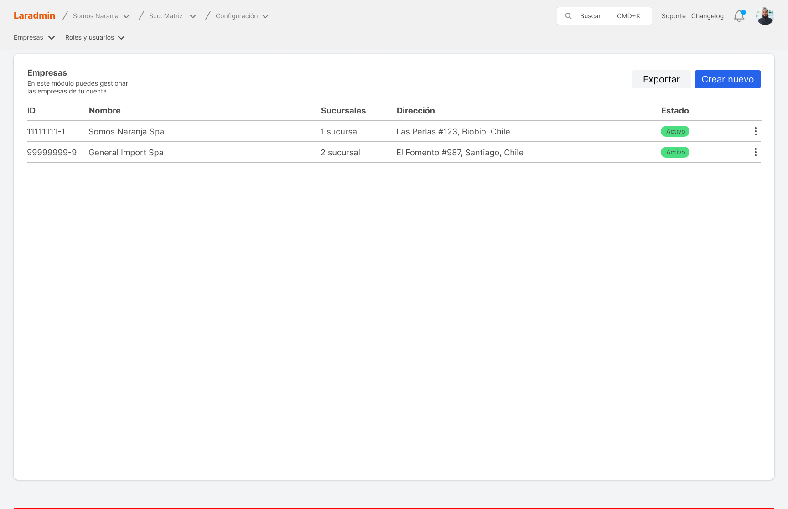

# Admin template Laravel/React

 



This project is an initial base for SAAS (Software as a Service) systems using Laravel and React.

## About template

- code quality
- commitlint
- precommit configurations
- prepush configurations
- docker services
- github actions
- semantic versioning
- changelog
- pint
- eslint
- prettier
- unit tests (pest)
- unit tests (vitest)
- e2e tests (playwright)
- cache (redis)
- logging (sentry)
- mail
- notifications (reverb)
- auth
- users
- modules
- companies
- roles
- permissions

## Installation

1. Clone the repository

   ```bash
   git clone https://github.com/geekhadev/laravel-admin-template.git
   ```

2. Configure `.env` file

   ```bash
   cp .env.example .env
   ```

3. Install PHP dependencies

   ```bash
   composer install
   ```

4. Install JavaScript dependencies

   ```bash
   pnpm install
   ```

5. Run migrations

   ```bash
   php artisan migrate
   ```

6. Run seeders (optional)

   ```bash
   php artisan db:seed
   ```

7. Run backend development server

   ```bash
   php artisan serve
   ```

8. Run frontend development server

   ```bash
   pnpm run dev
   ```

> Note: You can change the database credentials in the `.env` file. And if not have the database, you can create with docker compose.

```bash
docker compose up -d
```

## Commands

- Run lint (JavaScript)

```bash
pnpm run lint
```

- Run Pint (PHP)

```bash
pnpm run pint
```

- Run format (JavaScript)

```bash
pnpm run format
```

- Test sentry integration

```bash
pnpm run sentry:test
```

- Run unit tests

```bash
pnpm run vitest
```

- Run e2e tests console

```bash
pnpm run playwrite
```

- Run e2e tests ui

```bash
pnpm run playwrite --ui
```

- Run generator interface tests

```bash
pnpm run playwright codegen
```

- Run unit tests or integration tests (PHP)

```bash
pnpm run pest
```

> These commands help to keep the code clean and functional before committing to the repository.

## Configurations in Google

### Gmail

How to configure the Gmail for send mail:

- Go to [Google Account](https://myaccount.google.com)
- Find "Create and manage application passwords"
- Create a new password for the application
- Use the password in the .env file

## Configurations in AWS

### S3

How to configure the S3 bucket in AWS:

> In [this video](https://www.youtube.com/watch?v=5tFMj_0IAxU) explain how to configure the S3 bucket in AWS.

## Configurar Discord

- Ve al canal de texto en Discord donde deseas recibir las alertas.
- Haz clic en el ícono de configuración del canal.
- Ve a la sección Integraciones y selecciona Crear Webhook.
- Asigna un nombre al webhook y copia la URL generada.
- Agrega a las variables de entorno la url de tu webhook `DISCORD_WEBHOOK_URL=https://discord.com/api/webhooks/XXXXXXXXX/YYYYYYYYY`

## Configurar Telegram

- En la aplicación de Telegram enviar un mensaje '/newbot' a @BotFather y seguir las instrucciones para crear el bot.
- Una vez creado, copiar el token proporcionado y copiar en las variables de entorno como TELEGRAM_BOT_TOKEN={API_TOKEN_OBTENIDO}

## Contributing

Thank you for considering contributing to the template! The contribution guide can be found in the [Contributing document](./CONTRIBUTING.md).

## Code of Conduct

In order to ensure that the Laravel community is welcoming to all, please review and abide by the [Code of Conduct](./CODE_OF_CONDUCT.md).

## Changelog

You can view the application changelog by visiting the `/changelog` path in your browser.

And there is a path in the project /changelog where the content is represented in the [Changelog file](./CHANGELOG.md).

## License

The template is open-sourced software licensed under the [MIT license](https://opensource.org/licenses/MIT).

## Support

For any inquiries or support, please contact me at [khalisser@gmail.com](mailto:khalisser@gmail.com) or connect with me on [LinkedIn](https://www.linkedin.com/in/geekhadev/).
